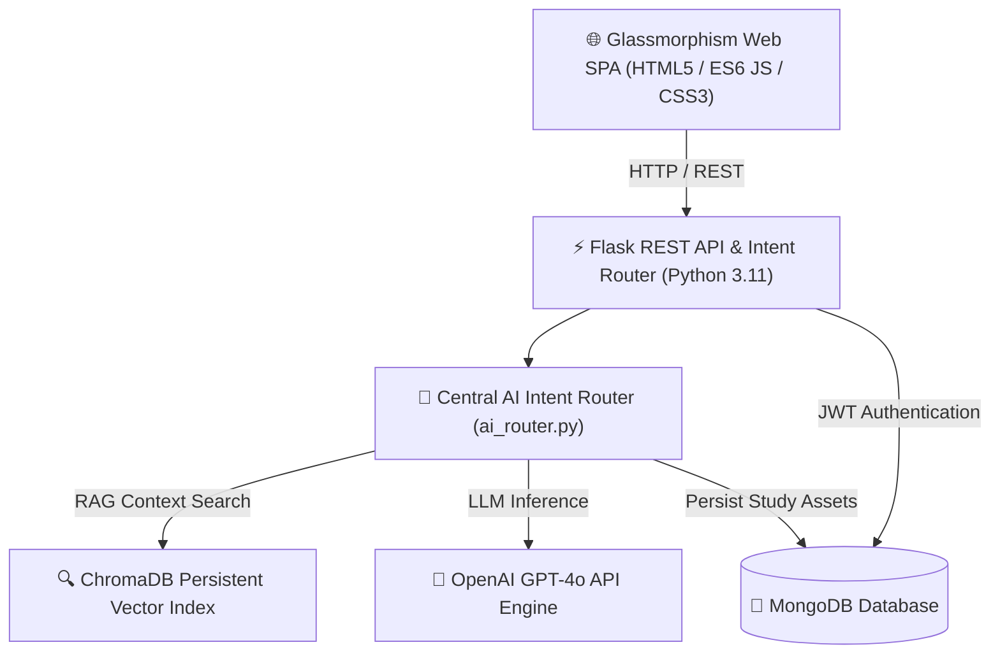

# noteX AI — Production AI-Powered Study Platform


**noteX AI** is a production-ready, AI-first study platform designed for students from **Class 1 to Class 12**. Built with a ChatGPT/Gemini-style conversational interface, noteX AI unifies AI Tutoring, RAG Document Search, Smart Notes, Adaptive Quizzes, Spaced Repetition Flashcards, Study Planning, and ML Performance Analytics into a single intelligent platform.

---

## 🏛️ System Architecture Diagram



---

## 🗄️ Database ER Diagram

```mermaid
erDiagram
    USERS ||--o{ CHAT_HISTORY : owns
    USERS ||--o{ DOCUMENTS : uploads
    USERS ||--o{ NOTES : generates
    USERS ||--o{ QUIZZES : creates
    USERS ||--o{ FLASHCARD_DECKS : owns
    USERS ||--o1 STUDY_PLANS : receives
    USERS ||--o1 ANALYTICS : tracks

    USERS {
        string id PK
        string email UK
        string password_hash
        string role
        string student_class
        int xp_points
    }

    DOCUMENTS {
        string id PK
        string user_id FK
        string filename
        int num_pages
        int num_chunks
    }

    NOTES {
        string id PK
        string user_id FK
        string chapter
        string note_type
        string content
    }

    QUIZZES {
        string id PK
        string user_id FK
        string title
        array questions
    }

    FLASHCARD_DECKS {
        string id PK
        string user_id FK
        string title
        int card_count
    }

    STUDY_PLANS {
        string id PK
        string user_id FK
        array daily_plan
        array weekly_plan
    }

    ANALYTICS {
        string id PK
        string user_id FK
        float mastery_score
        float retention_rate
        float predicted_score
    }
```

---

## 🚀 Key Modules & Capabilities

1. **AI Chatbot & Router (`app/chatbot/` & `app/services/ai_router.py`)**: ChatGPT/Gemini-style conversational assistant with word-by-word streaming simulation, markdown formatting, syntax highlighting, voice input/output (Web Speech API), chat search, and dynamic action buttons.
2. **PDF Upload & RAG Engine (`app/rag/` & `app/services/rag_service.py`)**: Page-by-page text extraction, vector embeddings via `SentenceTransformers`, and persistent vector search in `ChromaDB`.
3. **Unified "My Library" (`app/library/`)**: Single repository managing uploaded PDFs, AI Notes, Flashcards, Quizzes, Study Plans, and Chat Transcripts with search, preview, rename, and delete functions.
4. **AI Study Planner (`app/study_planner/` & `app/ml/`)**: Generates Daily Tasks, 7-Day Timetables, and Board Exam Revision Milestones using ML weak topic prioritization.
5. **Smart Notes AI (`app/notes/`)**: Generates 8 note formats (Smart Notes, Short Notes, Key Points, Revision Notes, Formula Sheets, One-Page Summaries, Exam Notes, Last-Minute Revision) with instant PDF export.
6. **AI Quiz System (`app/quiz/`)**: Generates MCQs, 1-Mark, 2-Mark, 5-Mark, and HOTS questions with automatic scoring, AI explanations, and global leaderboards.
7. **AI Flashcards & Active Recall (`app/flashcards/`)**: 3D interactive flip cards powered by RAG context retrieval, memory mnemonics, and Leitner spaced repetition (`Easy +15 XP`, `Medium +10 XP`, `Hard +5 XP`).
8. **ML Analytics Engine (`app/analytics/` & `app/ml/`)**: Scikit-Learn & XGBoost models evaluating Subject Mastery Index (%), Memory Retention Rate (%), ML Predicted Exam Grades (e.g. `90.0% Grade A+`), and Chart.js graphs.
9. **Admin Console (`app/admin/`)**: Isolated administration portal (`/api/admin/login`, `/api/admin/stats`, `/api/admin/users`, `/api/admin/logs`) enforcing Role-Based Access Control (RBAC).

---

## 🛠️ Tech Stack

- **Frontend**: HTML5, CSS3 (Vanilla Glassmorphism UI), JavaScript (ES6 SPA Router), Marked.js, Highlight.js, Chart.js, Web Speech API.
- **Backend**: Python 3.11+, Flask, REST APIs, Flask Blueprints, JWT Authentication, bcrypt.
- **Database**: MongoDB (PyMongo / MongoEngine) with in-memory fallback mode.
- **AI & Vector DB**: OpenAI API, SentenceTransformers, ChromaDB Vector Index, RAG Pipeline.
- **Machine Learning**: Scikit-Learn, XGBoost, NumPy, Pandas.
- **Deployment**: Docker, Docker Compose, Gunicorn WSGI, Nginx Reverse Proxy.

---

## ⚡ Quick Start (Local Development)

### 1. Environment Setup
```bash
git clone https://github.com/notex-ai/noteX_AI.git
cd noteX_AI

# Create virtual environment
python -m venv .venv
# Activate on Windows:
.venv\Scripts\activate
# Activate on Linux/macOS:
source .venv/bin/activate

# Install dependencies
pip install -r requirements.txt
```

### 2. Configure Environment Variables
Create a `.env` file in the root directory:
```env
FLASK_ENV=development
SECRET_KEY=dev-secret-key-12345
JWT_SECRET_KEY=jwt-dev-secret-key-67890
MONGO_URI=mongodb://localhost:27017/notex_ai
OPENAI_API_KEY=your-openai-api-key-here
ALLOWED_ORIGINS=*
```

### 3. Run Application
```bash
python app.py
```
Open [http://localhost:5000](http://localhost:5000) in your browser.

---

## 🐳 Production Deployment (Docker Compose)

```bash
# Build and launch production container stack
docker-compose up -d --build

# View container logs
docker-compose logs -f

# Stop containers
docker-compose down
```
Access on port `80` via Nginx reverse proxy.

---

## 🧪 Master Test Suite

Verify all 14 integration test modules:

```bash
python scratch/test_all_modules.py
```

---

## 💼 Resume & Portfolio Description

> **noteX AI — AI-Powered Study Platform (Full Stack & ML Engineer)**
> - Engineered an AI-first study platform for Class 1-12 students featuring a ChatGPT/Gemini conversational UI, RAG document search, and ML analytics.
> - Implemented an **AI Intent Router** orchestrating LLM inferences, ChromaDB vector retrieval, and automated creation of Notes, Quizzes, Flashcards, and Study Plans.
> - Built an isolated **Admin Console** with RBAC authorization and system audit logging.
> - Containerized microservices using **Docker**, **Docker Compose**, **Gunicorn WSGI**, and **Nginx** reverse proxying.

---

## 📄 License & Attribution

Developed by the **noteX AI Core Team** for production educational deployments.
