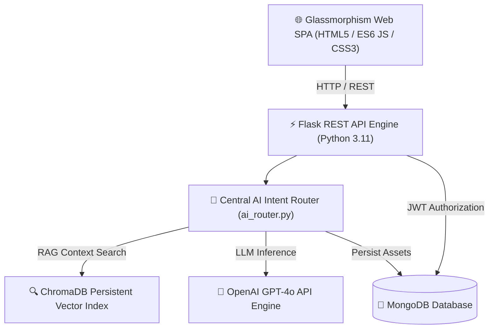

<div align="center">

# 🎓 noteX AI — Production AI-First Study Platform

[](https://github.com/ANHADKN/NOTE_X_AI/releases)
[](https://github.com/ANHADKN/NOTE_X_AI/actions)
[](https://www.python.org/)
[](https://flask.palletsprojects.com/)
[](https://www.mongodb.com/)
[](https://www.trychroma.com/)
[](LICENSE)

*An intelligent, conversational AI tutor designed for Class 1 to Class 12 students. Seamlessly unifies ChatGPT/Gemini-style AI conversations, RAG document search, smart note generation, adaptive quizzes, 3D flashcards, study planning, and machine learning performance analytics into a single glassmorphic web app.*

[Explore Features](#-features) • [System Architecture](#-system-architecture) • [Quick Start](#-quick-start) • [API Reference](#-api-overview) • [Deployment](#-production-deployment-docker)

</div>

---

## 📸 Screenshots & UI Showcase

| 💬 ChatGPT AI Tutor Homepage | 📚 Unified "My Library" Asset Hub |
|:----------------------------:|:----------------------------------:|
|  |  |

| 📊 ML Analytics & Mastery Engine | 🧠 3D Interactive Flashcards |
|:--------------------------------:|:-----------------------------:|
|  |  |

---

## ✨ Core Features Matrix

- 🤖 **Central AI Intent Router (`ai_router.py`)**: Analyzes every prompt to detect intent (`GENERATE_NOTES`, `GENERATE_QUIZ`, `GENERATE_FLASHCARDS`, `GENERATE_STUDY_PLAN`, `VIEW_ANALYTICS`, `RAG_PDF_SEARCH`), enriches with RAG vector search, and outputs interactive action buttons.
- 📄 **PDF Upload & RAG Vector Engine**: Semantic text extraction (`pypdf` / `pdfplumber`), embeddings via `SentenceTransformers`, and vector chunk querying in `ChromaDB` with page citations (`Page X`).
- 📚 **Unified "My Library"**: Search, filter, preview, rename, and delete uploaded PDFs, AI Notes, Flashcard Decks, Quizzes, Study Plans, and Chat History from one hub.
- 📝 **Smart Notes AI Generator**: Instant generation of 8 structured note formats (Smart Notes, Short Notes, Key Points, Revision Notes, Formula Sheets, Summaries, Exam Notes, Last-Minute Revision) with PDF printing/export.
- ❓ **AI Quiz System & Leaderboards**: MCQs, 1-Mark, 2-Mark, 5-Mark, and HOTS questions with automated score evaluation, AI explanations, and global XP leaderboards.
- 🧠 **3D Active Recall Flashcards**: Interactive 3D flip card runner using Leitner spaced repetition rating (`Easy +15 XP`, `Medium +10 XP`, `Hard +5 XP`).
- 📅 **AI Study Planner**: 7-Day timetables and Board Exam revision roadmaps generated using ML weak topic prioritization.
- 📈 **ML Performance Analytics**: Scikit-Learn and XGBoost algorithms calculating Subject Mastery Index (%), Memory Retention Rate (%), and ML Predicted Exam Score (`A+ 90%`).
- 🛡️ **Isolated Admin Console**: Separate admin login (`/api/admin/login`), user management, system metrics, and audit log tracking.

---

## 🏛️ System Architecture



---

## 🗄️ Database ER Diagram

```mermaid
erDiagram
    USERS ||--o{ CHAT_HISTORY : owns
    USERS ||--o{ DOCUMENTS : uploads
    USERS ||--o{ NOTES : generates
    USERS ||--o{ QUIZZES : creates
    USERS ||--o{ FLASHCARD_DECKS : owns
    USERS ||--o1 STUDY_PLANS : receives
    USERS ||--o1 ANALYTICS : tracks

    USERS {
        string id PK
        string email UK
        string password_hash
        string role
        string student_class
        int xp_points
    }

    DOCUMENTS {
        string id PK
        string user_id FK
        string filename
        int num_pages
        int num_chunks
    }

    NOTES {
        string id PK
        string user_id FK
        string chapter
        string note_type
        string content
    }

    QUIZZES {
        string id PK
        string user_id FK
        string title
        array questions
    }

    FLASHCARD_DECKS {
        string id PK
        string user_id FK
        string title
        int card_count
    }

    STUDY_PLANS {
        string id PK
        string user_id FK
        array daily_plan
        array weekly_plan
    }

    ANALYTICS {
        string id PK
        string user_id FK
        float mastery_score
        float retention_rate
        float predicted_score
    }
```

---

## 🛠️ Technology Stack

| Category | Technology |
|---|---|
| **Frontend** | Vanilla CSS3 (Glassmorphism), JavaScript (ES6 SPA Router), Marked.js, Highlight.js, Chart.js, Web Speech API |
| **Backend** | Python 3.11, Flask 3.0, Flask Blueprints, PyMongo, JWT Auth, Bcrypt |
| **Database & Cache** | MongoDB 6.0 (with in-memory dictionary fallback mode) |
| **AI & RAG** | OpenAI GPT-4o, ChromaDB Persistent Vector Store, SentenceTransformers |
| **Machine Learning**| Scikit-Learn, XGBoost, NumPy, Pandas |
| **DevOps & Containers**| Docker, Docker Compose, Gunicorn WSGI, Nginx Reverse Proxy |

---

## ⚡ Quick Start (Local Setup)

### 1. Clone Repository
```bash
git clone https://github.com/ANHADKN/NOTE_X_AI.git
cd NOTE_X_AI
```

### 2. Environment Setup
```bash
# Create Python Virtual Environment
python -m venv .venv

# Activate Virtual Environment (Windows)
.venv\Scripts\activate

# Activate Virtual Environment (Linux / macOS)
source .venv/bin/activate

# Install Dependencies
pip install -r requirements.txt
```

### 3. Configuration (.env)
Create a `.env` file in the project root:
```env
FLASK_ENV=development
SECRET_KEY=dev-secret-key-12345
JWT_SECRET_KEY=jwt-secret-key-67890
MONGO_URI=mongodb://localhost:27017/notex_ai
OPENAI_API_KEY=your_openai_api_key_here
ALLOWED_ORIGINS=*
```

### 4. Run Application
```bash
python app.py
```
Open browser at [http://localhost:5000](http://localhost:5000).

---

## 🐳 Production Deployment (Docker)

Launch the complete microservices stack using Docker Compose:

```bash
docker-compose up -d --build
```
Access the application on port `80` (handled by Nginx reverse proxying to Gunicorn WSGI workers).

---

## 🧪 Master Test Suite Verification

Run the master integration test suite verifying all 14 module test runners:

```bash
python scratch/test_all_modules.py
```

---

## 📄 API Overview

| Method | Endpoint | Description | Auth Required |
|---|---|---|---|
| `GET` | `/api/health` | System health check and blueprint registry | No |
| `POST` | `/api/auth/register` | Register student account | No |
| `POST` | `/api/auth/login` | Authenticate user & receive JWT token | No |
| `POST` | `/api/chatbot/message` | Submit conversational tutor prompt (AI Router) | Yes |
| `POST` | `/api/rag/upload` | Upload PDF textbook & index ChromaDB vectors | Yes |
| `GET` | `/api/library/assets` | Retrieve user assets with search & filtering | Yes |
| `POST` | `/api/notes/generate` | Generate AI Smart Note (8 formats) | Yes |
| `POST` | `/api/quiz/generate` | Generate AI Quiz (MCQ / 1-5 Marks / HOTS) | Yes |
| `POST` | `/api/flashcards/generate` | Generate 3D Active Recall Deck | Yes |
| `GET` | `/api/study-plan/today` | Fetch daily timetable & revision tasks | Yes |
| `GET` | `/api/analytics/overview` | Fetch ML Subject Mastery & Grade Prediction | Yes |
| `POST` | `/api/admin/login` | Authenticate Administrator session | No |

---

## 🤝 Contributing

Contributions are welcome! Please read our [CONTRIBUTING.md](CONTRIBUTING.md) and [CODE_OF_CONDUCT.md](CODE_OF_CONDUCT.md) for details on code submission protocols.

---

## 📜 License

Distributed under the **MIT License**. See [LICENSE](LICENSE) for details.

---

## 👤 Author

Developed with ❤️ by **[ANHADKN](https://github.com/ANHADKN)** and the **noteX AI Core Team**.
