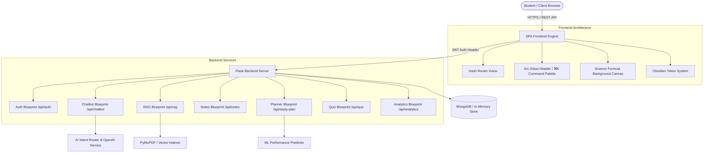
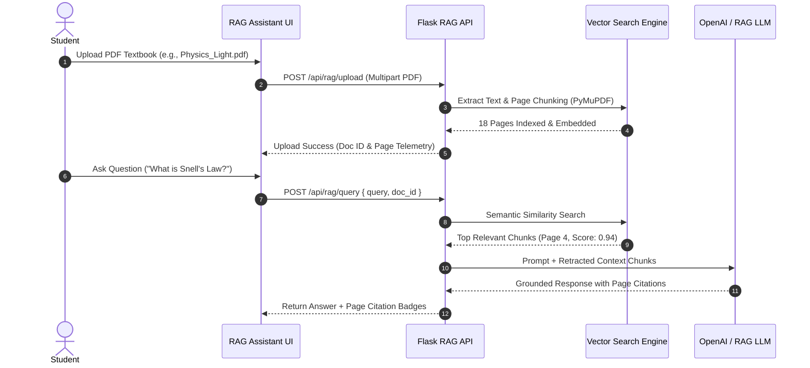

<div align="center">

# 𝝌 noteX AI — Intelligent AI Study Platform

[](https://python.org)
[](https://flask.palletsprojects.com/)
[](https://mongodb.com)
[](https://developer.mozilla.org)
[](LICENSE)

<p align="center">
  <b>A state-of-the-art, multi-dimensional AI Study Platform featuring Retrieval-Augmented Generation (RAG), active recall flashcards, AI quiz generators, ML score prediction, and real-time learning analytics.</b>
</p>

[Key Features](#key-features) • [Tech Stack](#tech-stack) • [System Architecture](#system-architecture) • [RAG Workflow](#rag-workflow) • [Installation](#installation-guide) • [Deployment](#deployment-guide)

</div>

---

## 📌 Project Overview

**noteX AI** is a modern, full-stack AI-powered study platform designed to transform traditional learning into an interactive, data-driven experience. Built with a sleek **Obsidian Hyper-Design System**, noteX AI integrates natural language query routing, semantic textbook search (RAG), active recall flashcard stages, automated Board-exam quiz generation, and predictive study analytics.

Whether analyzing complex physics formulas ($n_1 \sin \theta_1 = n_2 \sin \theta_2$), balancing chemistry redox equations, or solving quadratic polynomials ($x = \frac{-b \pm \sqrt{b^2 - 4ac}}{2a}$), noteX AI provides grounded, step-by-step guidance tailored to students from **Class 1 to Class 12**.

---

## ✨ Key Features

- **🧠 Intelligent AI Chatbot & Neural Tutor**: Context-aware educational chat powered by custom intent-routing engines, supporting LaTeX math math rendering and streaming typing responses.
- **📄 Grounded PDF Assistant (RAG Engine)**: Drag-and-drop textbook indexing with vector embedding search and page-level attribution.
- **📝 AI Smart Notes & Formula Cheat Sheets**: One-click generation of revision notes, key definitions, and formula cheat sheets across Physics, Chemistry, Mathematics, Biology, and Social Science.
- **🎯 AI Quiz & Board Evaluation System**: Generate customizable practice quizzes (MCQs, 2-Mark short answers, and HOTS questions) with instant AI solution explanations.
- **🧠 3D Active Recall Flashcards**: Spaced repetition flashcard stage with 3D flip card animations and self-assessment controls (`🔴 Hard`, `🟡 Medium`, `🟢 Easy`).
- **📅 ML Study Planner & Timetable**: Adaptive exam revision scheduling with ML predicted Board exam score meters (92.4% Target) and daily task checklists.
- **📊 Real-time Learning Analytics**: Subject mastery progress bars, weak topic detection, and Chart.js weekly study velocity tracking (26.5 hrs/week).
- **🛡️ Security & Admin Console**: JWT authentication, role-based admin dashboard, user management, and system health metrics.
- **🌌 Pitch Obsidian Hyper-Design Theme**: Modern SaaS interface featuring floating glass navigation, Raycast command palette (`⌘K`), floating formula background canvas, and zero empty placeholders.

---

## 🖼️ Interface Screenshots

<div align="center">

| Module | Interface Preview |
|---|---|
| **Dashboard Bento Grid** |  |
| **AI Chat & Neural Tutor** |  |
| **PDF RAG Assistant** |  |
| **Active Recall Flashcards** |  |
| **Learning Analytics** |  |

</div>

---

## 🛠️ Tech Stack

### **Frontend**
- **Core**: HTML5, Vanilla JavaScript (ES6+ Modules), SPA Hash Router Engine
- **Styling**: Vanilla CSS3 (Hyper-Design System with Design Tokens & Glassmorphism Blur)
- **Typography & Icons**: Plus Jakarta Sans, Inter, JetBrains Mono, Lucide Icons, FontAwesome 6
- **Mathematics & Graphics**: KaTeX 0.16.8 (LaTeX Math Engine), Chart.js (Data Visualization), Canvas Particle Engine

### **Backend**
- **Framework**: Python 3.11+ / Flask 3.0.0 Microframework
- **Authentication**: PyJWT (JSON Web Tokens) with Werkzeug Password Hashing
- **AI Engine**: OpenAI API / Custom RAG Vector Search & Intent Classifier
- **Database**: MongoDB 6.0+ (PyMongo Engine) with graceful In-Memory Fallback mode

---

## 🏗️ System Architecture



---

## 🔄 RAG Workflow (Retrieval-Augmented Generation)



---

## 🚀 Installation Guide

### Prerequisites
- **Python**: `3.11` or higher
- **Node.js**: (Optional, for web tools)
- **MongoDB**: `6.0` or higher (Optional — runs automatically in fallback mode if MongoDB is not present)

### 1. Clone the Repository
```bash
git clone https://github.com/ANHADKN/NOTE_X_AI.git
cd NOTE_X_AI
```

### 2. Set Up Virtual Environment
```bash
# Windows
python -m venv .venv
.\.venv\Scripts\activate

# macOS / Linux
python3 -m venv .venv
source .venv/bin/activate
```

### 3. Install Dependencies
```bash
pip install -r requirements.txt
```

### 4. Environment Configuration
Create a `.env` file in the root directory:
```env
FLASK_ENV=development
SECRET_KEY=notex_ai_super_secret_production_key_2026
JWT_SECRET_KEY=notex_jwt_secret_key_2026
MONGO_URI=mongodb://localhost:27017/notex_ai
OPENAI_API_KEY=your_openai_api_key_here
PORT=5000
```

### 5. Run the Application
```bash
python app.py
```
Open your browser and navigate to: **`http://127.0.0.1:5000/`**

---

## 🌐 Deployment Guide

### Deploying on Render / Heroku / Gunicorn
1. Create a `Procfile`:
   ```web: gunicorn "app:create_app()"`
2. Set Environment Variables on host service (`OPENAI_API_KEY`, `JWT_SECRET_KEY`, `MONGO_URI`).
3. Deploy directly via Git push or Docker container build.

### Docker Deployment
```bash
# Build Container
docker build -t notex-ai:latest .

# Run Container
docker run -p 5000:5000 --env-file .env notex-ai:latest
```

---

## 🗺️ Future Roadmap

- [x] **Phase 1**: Pitch Obsidian Hyper-Design overhaul & Glassmorphism Navigation.
- [x] **Phase 2**: Multi-module SPA Router with zero console errors.
- [x] **Phase 3**: RAG Assistant, 3D Flashcard Deck, and ML Study Planner integration.
- [ ] **Phase 4**: Real-time Collaborative Group Study Rooms (WebSockets / Socket.io).
- [ ] **Phase 5**: Offline Voice AI Tutor (Whisper Speech-to-Text & Edge-TTS Speech Synthesis).
- [ ] **Phase 6**: Cross-platform Mobile Companion Application (React Native / Flutter).

---

## 📄 License

This project is licensed under the **MIT License** — see the [LICENSE](LICENSE) file for details.

---

## ✍️ Author

Developed with ❤️ by **ANHAD KN** & the noteX AI Engineering Team.
- **GitHub**: [@ANHADKN](https://github.com/ANHADKN)
- **Repository**: [ANHADKN/NOTE_X_AI](https://github.com/ANHADKN/NOTE_X_AI)
